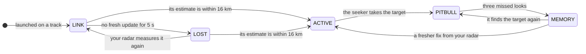

A radar missile flies in two halves. First it steers on **datalink updates from your radar**. Then, close enough, it switches on **its own seeker** and homes by itself. Every radar missile in the game, named or not, runs the same homing and seeker; the card you pick only changes the airframe, the motor and the loft.

## What you need to fire

- **A round.** You carry **4**.
- **A launch-quality track** on your target: confirmed and freshly measured. Until then the weapon line reads LOCKING.
- **Room under your radar's guidance limit.** Each radar can only guide missiles onto so many targets at once. A second missile on a target already being guided is always allowed. [Track numbers and locks](/radar/locking/#numbered-tracks-and-the-guidance-limit) explains the limit.

[Taking the shot](/weapons/launching/) lists every refusal message.

## Datalink midcourse

After launch your radar feeds the missile its track. **An update goes up only when your radar has actually measured the target again**: a coasting track sends nothing, and the missile flies on the last update it had, moved on at the target's velocity at the time.

**The link only runs while the track has a number** (or is your current target). Drop the number with <Key k="U" /> and that missile's datalink ends, even though the scope still shows the contact. An update counts as fresh for **5 s**.<SimChoice /> Losing the link doesn't end the shot.

## The seeker switches on at 16 km

The missile turns its seeker on when **its own estimate** of the target comes within **16 km**, for every radar missile in the game.<SimChoice />

**Switching on is not the same as finding the target.** While searching, the seeker looks 40 times a second inside a cone of **about 29°** around the missile's nose, and only accepts an echo near where it expects the target and at about the closing speed it expects. The older the last update, the wider it looks, as far as a fighter pulling 3 g could have strayed. It needs a clear line of sight past the terrain, and the ground clutter and the notch work on it as on any radar ([Doppler, clutter and the notch](/radar/doppler-and-clutter/)).

## PITBULL: the seeker has it

When the seeker takes the target, the missile flies on its own measurements from then on, and the HUD shows **PITBULL** once for that missile. From then on the seeker only accepts echoes within **150 m** of the predicted range, **3°** of the predicted direction and **40 m/s** of the predicted closing speed.

**It calls the target lost after three missed looks in a row** (75 ms) and goes to **memory**: it flies its last estimate onward and keeps looking, with its gates widening over time. If your radar has measured the target more recently than the seeker did, it goes back to searching around your radar's position.

**There is no memory timeout.** A missile that never finds its target flies until its **120 s** battery runs out and ends as BATTERY SPENT, with no detonation.<SimChoice />

<Callout kind="radar" title="It homes on its estimate, not on the aircraft">
  Until its seeker has the target, the missile only knows what your radar last told it. If the target turns hard after your link drops, the missile flies to where the target would have been, and has to find it inside its widening search when the seeker comes on.
</Callout>

## Chaff and the notch

The seeker treats chaff as more echoes, put through the same tests as the aircraft, and picks the one **closest to where it predicted the target**, not the brightest. Chaff slows almost to a stop within a couple of seconds, so it soon falls outside the 40 m/s speed gate, unless the aircraft itself has almost no speed along the missile's line of sight. [Chaff](/survival/chaff/) and [Notching](/survival/the-notch/) cover the defensive side.

## MADDOG

With the radar missile selected and **no target designated**, hold <Key k="F" hold /> for **0.5 s** to fire MADDOG: a missile with no track and no datalink. While you hold the key, the weapon line reads MADDOG · NO IFF.

- It doesn't need a track, and it doesn't count against your radar's guidance limit.
- It flies at a point **50 km straight ahead** of where it was launched.
- Its seeker comes on **0.5 s** after launch and searches a narrow **7.5°** cone around its nose.<SimChoice />
- **The first echo it sees becomes its target**: any aircraft or chaff cloud in that cone. There is no friend-or-foe check.
- With nothing found **30 s** after its seeker came on, it ends as SELF-DESTRUCT.<SimChoice />

## The DATALINK list

While you have radar missiles in the air, a DATALINK list sits above the radar scope (or beside it when there is no room), one row per missile, for example `M1 ▸2 LINK A12`.

- **M1, M2…** names the missile.
- **▸2** is the track number it flies on, or **▸-** once that number is dropped.
- **The timer** reads A (seconds until its seeker switches on) during midcourse, then T (seconds to arrival), up to 99. It shows `A--` or `T--` when the missile can't catch the target, and `--` for a MADDOG.

| Word | Meaning |
| --- | --- |
| LINK | Midcourse, with fresh datalink updates. |
| LOST | Midcourse, with no fresh update for 5 s. The row dims. |
| ACTIVE | Its seeker is on and searching. |
| PITBULL | Its seeker has the target. The one pulsing chip. |
| MEMORY | Its seeker lost the target. The row dims. |
| MADDOG | A MADDOG missile still searching. |

## The loft

Named radar missiles fired at an estimated range over 24 km first climb in a game-made arc. The reference round, which the enemy always fires, flies direct. [How a missile steers](/weapons/guidance/#the-loft) gives the details.

<Callout kind="tip" title="In the cockpit">
  - **Keep the track numbered** until you see PITBULL. Dropping it, or letting your radar lose it, leaves the missile flying on old information.
  - **MADDOG takes the first echo in its 7.5° cone**, so fire it with the bandit, not a chaff cloud, straight ahead.
</Callout>
