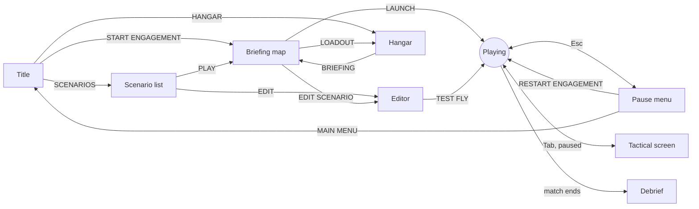

Hardlock has six screens (title, scenario list, editor, hangar, briefing and playing) and four overlays that can sit on top of play (pause, settings, the tactical screen and the debrief). The world keeps running behind the menus whenever the game is not paused.

## The title screen

| Item | What it does |
| --- | --- |
| START ENGAGEMENT | Opens the briefing map. |
| SCENARIOS | Opens the scenario list. See [Scenarios and the editor](/world/scenarios/). |
| HANGAR | Opens the hangar, where you pick an aircraft and its missiles. |
| SETTINGS | Opens settings on the Display page. |
| CONTROLS | Opens settings on the Keybinds page. |
| QUIT | Hold it to confirm. |

You can drive every menu from the keyboard: <Key k="↑" />/<Key k="↓" /> or <Key k="W" />/<Key k="S" /> to move, and <Key k="Enter" /> or <Key k="Space" /> to choose.

## The hangar

The hangar shows the selected aircraft with its full load of missiles on their stations (a stealth type keeps its bays shut). Drag to turn it and use the mouse wheel to zoom.

Changing a named missile changes its visible shape and finish on the aircraft and in flight. Closely related variants can share a silhouette. Shapes with unpublished details are artistic approximations.

- **Lists:** AIRCRAFT, HEAT SEEKER and RADAR ROUND are tabs along the top. <Key k="Q" /> and <Key k="E" /> change list, and <Key k="W" />/<Key k="S" /> or <Key k="↑" />/<Key k="↓" /> step through the open one. Each list is grouped by family. Aircraft you cannot fly read NOT FLYABLE; radar rounds flown on estimated figures read ESTIMATE.
- **Loadout:** the right column has one slot per list, showing what is fitted. Click a slot to open its list. Under the slots, a card describes whatever you point at, or the current pick of the open list.
- **Under the aircraft:** its name and bars for thrust-to-weight, wing loading, load limit and sea-level speed. A figure with no public source reads "Not published".
- **Comparing:** point at another aircraft and the bars show its figures against yours. Gained segments are solid, lost ones hollow, and a caret beside each value says up or down.

**BRIEFING** (<Key k="Enter" />) goes on to the briefing map; <Key k="Esc" /> goes back to the title.

<Callout kind="note" title="The hangar makes you a pilot">
  Picking any aircraft or missile in the hangar switches you to the fighter role. If you were running the ground launcher, the hangar header warns you first.
</Callout>

## The briefing map

The briefing is a high, orbiting view over the terrain, centred between the two bases. Drag to orbit and use the wheel to zoom. The map shows range rings every 10 km from your base, north, the dashed edge of the area the enemy pilots stay inside, the enemy base (HOSTILE AIRFIELD) and every enemy aircraft in the air as T1, T2… Point at one to open its card. A scenario with more flights or zones also draws them where they start, with friendly flights marked as such in the map key.

The column on the right sets up the fight. Its rows work like [Settings](/interface/settings/): arrows or <Key k="←" />/<Key k="→" /> step a value. Pointing at a row describes it in the panel below; with nothing under the cursor, that panel shows the SITUATION: the scenario's mode, the distance to the enemy base, how many hostiles are airborne, their skill, whether the opening repeats, then any time limit, your jets and other flights, and the scenario's briefing text. The map key sits at the bottom left. **EDIT SCENARIO** opens the setup in the [editor](/world/scenarios/#the-editor).

| Group | Setting | Options | Notes |
| --- | --- | --- | --- |
| SCENARIO | Scenario | CUSTOM, then every saved scenario | Picking one sets every row below. See [Scenarios](#scenarios). |
| | Name and SAVE | | Saves the rows under the name you type. |
| ENGAGEMENT | You fly | SAM SITE or FIGHTER | See [The ground launcher](/world/ground-launcher/). |
| | Mode | SANDBOX, RAID CAMPAIGN, ENDLESS RAIDS | SAM site only. The raid modes are [Base defence](/world/base-defence/); they hide the Aircraft, Their aircraft, Distance and Start height rows, and LOADOUT lists the base's launchers. |
| | Terrain | MOUNTAINS or FLAT | See [The theater](/world/theater/). |
| OPPOSITION | Aircraft | 1 to 20 | The formation respawns after each step, or when you let go of the bar. |
| | Skill | ROOKIE, VETERAN, ACE | Takes effect at once. See [Enemy pilots](/world/enemy-pilots/). |
| | Their aircraft | MIXED or one type | MIXED flies Su-27S, MiG-29, Su-35S, Su-27S by place in the flight. One type puts the whole flight in it. |
| | Distance | 10 to 50 km, default 48 | How far away their base is. |
| | Start height | 1000 to 12000 m, default 6500 | Above the ground where they take off. |
| | Same opening | on / off | On, every launch and restart opens the same way. |
| | Weapons free | on / off | Fighter role only. Off means the enemy never fires. |
| | Hostile radar | on / off | Fighter role only. Also <Key k="N" /> in flight. |
| LOADOUT | Aircraft and rounds | | Fighter role: a slot that opens the hangar. SAM site: the launcher's round and reload. |

**LAUNCH** (<Key k="Enter" />) starts the engagement with a fresh random seed, so the formation flying behind the menus is replaced by a new one. With **Same opening** on, the seed is kept instead: the formation and the plans the enemy pilots open with are the same on every launch, so an opening can be learned.

### Scenarios

The Scenario row lists every [scenario](/world/scenarios/), the ones the game ships first, then your own. Picking one sets every row below, along with its rules, its other flights and its script.

Change any row after picking a scenario and the row reads CUSTOM: the setup is yours until you save it, and it keeps the scenario's rules and flights. Type a name in the field under the row and press **SAVE**. Saving under a name you already used replaces that scenario. Your scenarios are kept as files in the `config/scenarios` folder next to the game. The list is read again each time you open the briefing.

## The tactical screen

Press <Key k="Tab" /> in flight to open the full-screen tactical screen. **It pauses the simulation.** It has five categories: WEAPON, TARGETS, WORLD, TELEMETRY and MISSION. [The tactical screen](/interface/tactical-screen/) goes through every control.

## Pausing and restarting

| Key | Effect |
| --- | --- |
| <Key k="Esc" /> | Pause menu. Press it again to resume. |
| <Key k="Enter" /> | Pause or resume without a menu. |
| <Key k="Tab" /> | Tactical screen, paused. |

The pause menu offers RESUME, RESTART ENGAGEMENT, SETTINGS, CONTROLS, MAIN MENU and QUIT TO DESKTOP. RESTART ENGAGEMENT, MAIN MENU and QUIT TO DESKTOP have to be held to confirm. Restarting draws a new seed, just like LAUNCH, unless **Same opening** is on. While you test fly a scenario from the editor, MAIN MENU reads BACK TO EDITOR.

## The debrief

A scenario that can be won or lost ends with the debrief: victory or defeat, the reason, your results and, for waves and the sandbox, a score. From it you restart, go back to the briefing or leave for the title screen; [Scenarios and the editor](/world/scenarios/#the-debrief) has the details. The open sandbox never ends on its own, so its feedback stays in the moment: **SPLASH** when one of your missiles destroys an aircraft, and **SHOT ENDED** with a reason whenever a missile ends its flight. [The HUD](/interface/hud/#notices-above-the-weapon-line) describes both.
